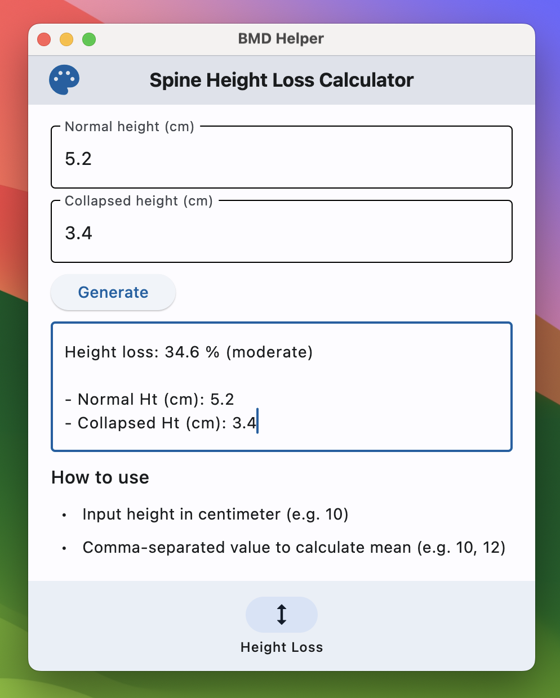

# BMD Helper Application 

> **Cross-platform calculator application for BMD calculation.**

---

**Build using [Flet](https://flet.dev/)**, a cross-platform UI framework in Python.

- **Desktop app:** see [release](https://github.com/Lightbridge-KS/nm-bmd-app/releases)
- **Webapp:** <https://nm-bmd-helper-lightbridge.netlify.app>

---
