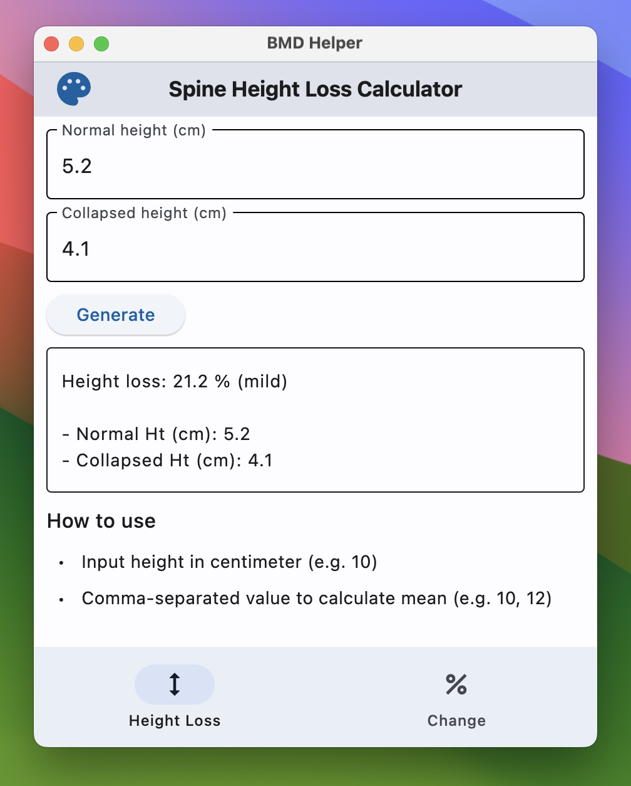

# BMD Helper Application 

> **Cross-platform calculator application for BMD.**

---

**Build using [Flet](https://flet.dev/)**, a cross-platform UI framework in Python.

- **Desktop app:** see [release](https://github.com/Lightbridge-KS/nm-bmd-app/releases)

---
